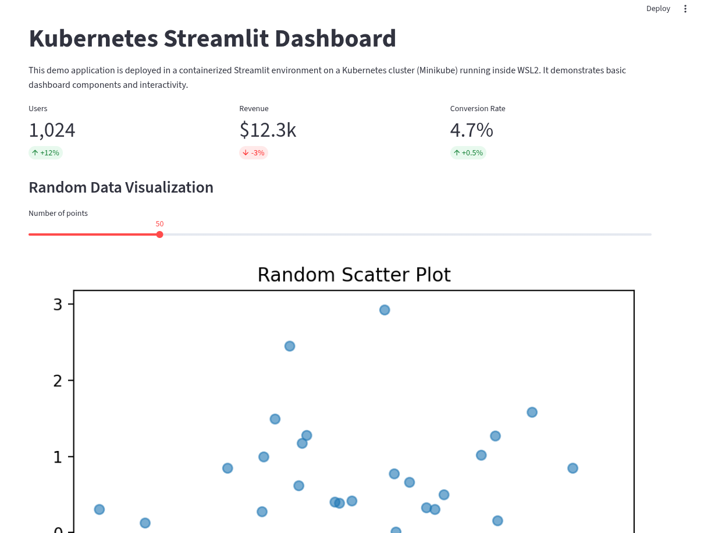

# Kubernetes Streamlit Dashboard

This project demonstrates the deployment of a Python-based Streamlit dashboard on a Kubernetes cluster using **Minikube** inside **WSL2**.  
It simulates a production-style setup — with containerized application, declarative manifests, and a service to expose the app — but runs locally for learning and portfolio purposes.

## Tech Stack
- **Python 3.11** — App development
- **Streamlit** — Web application framework
- **pandas**, **numpy**, **matplotlib** — Data manipulation and visualization
- **Docker** — Containerization
- **Kubernetes** — Container orchestration
- **Minikube** — Local Kubernetes cluster
- **WSL2** — Linux environment on Windows

## Features
- Deployment defined via Kubernetes YAML manifests
- NodePort service for external access to the dashboard
- Interactive dashboard with KPI metrics, chart, and user-controlled parameters
- Runs entirely inside WSL2 for a production-like workflow

## Quickstart
Clone this repository and deploy the app on your local Minikube cluster:

\`\`\`bash
git clone git@github.com:SandraMargot/streamlit-dashboard-k8s.git
cd streamlit-dashboard-k8s
kubectl apply -f k8s/
minikube service dashboard-service
\`\`\`

Make sure Minikube is running in WSL2 with the Docker driver enabled.

## Architecture

```mermaid
flowchart LR
    subgraph WIN[Windows]
        BROWSER[Web Browser]
    end

    subgraph WSL[WSL2 (Ubuntu)]
        subgraph MK[Minikube Cluster]
            subgraph NS[default namespace]
                SVC[NodePort Service\n dashboard-service:8501]
                subgraph DEPLOY[Deployment\n dashboard-deployment]
                    POD[Pod]
                    CONTAINER[Container\n streamlit-dashboard:v0.3]
                    APP[Streamlit App]
                end
            end
        end
    end

    BROWSER <-- HTTP --> SVC
    SVC --> POD
    POD --> CONTAINER --> APP
```markdown
This diagram shows the local browser on Windows reaching the Kubernetes **NodePort Service** in Minikube (running inside **WSL2**), which routes traffic to the **Pod** running the **Streamlit** container.

This diagram shows the local browser on Windows reaching the Kubernetes **NodePort Service** in Minikube (running inside **WSL2**), which routes traffic to the **Pod** running the **Streamlit** container.

## Live Demo Screenshot



## Future Improvements
- Add CI/CD pipeline (GitHub Actions) to automate image build and Kubernetes deployment.
- Use a Helm chart for easier configuration management and deployment.
- Add authentication to restrict access to the dashboard.
- Expand dashboard with real-world data sources.
- Integrate persistent storage for long-term data retention.
- Implement resource requests/limits and horizontal pod autoscaling.
